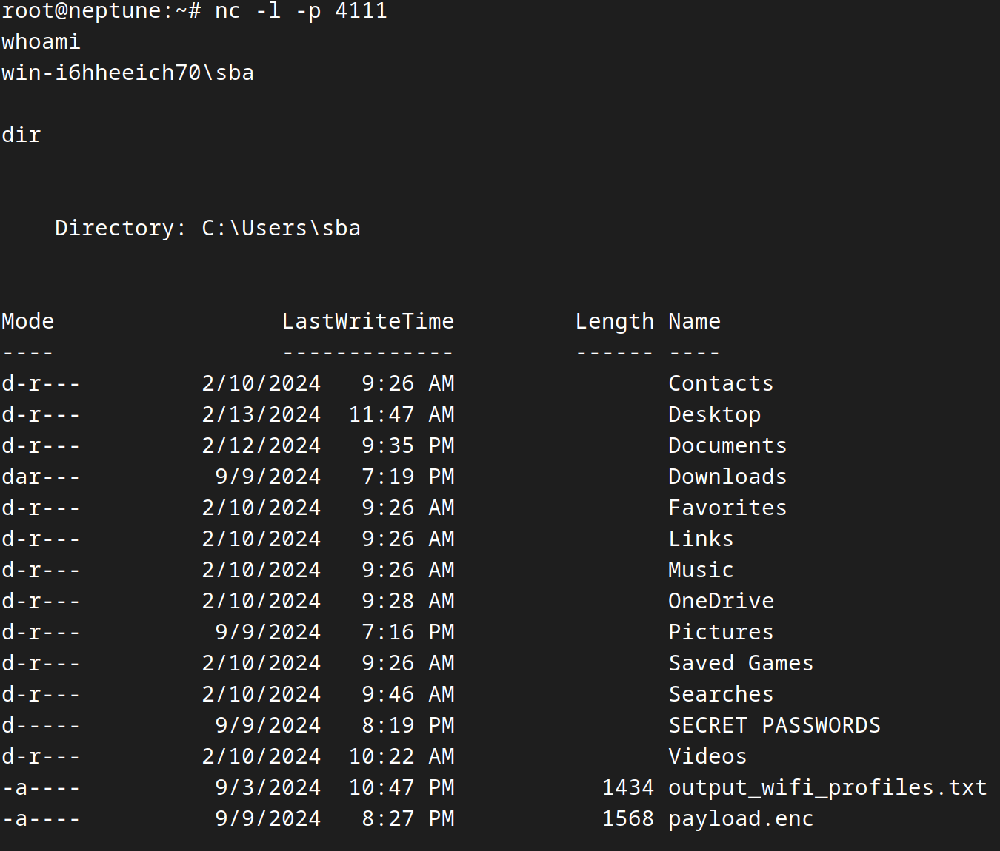

# The Bypass Buddy:  Bypass Script Execution Policies

Running user (target) does **not** need to have admin rights. Bypass Buddy has only been tested on the [O.MG Plug Elite](https://hak5.org/products/omg-plug), Windows 11.   It likely works on other [hak5 devices](https://hak5.org/products/) and Windows distributions -- the payload is written in standard DuckyScript&trade;.

## Overview

### Target Has a Strict "Script Execution Policy"?  Evade it and Run Whatever Script You Please!

In this DuckyScript&trade;, we explore a method to evade Windows 11's Script Execution Policy protections.  The approach involves downloading a script to RAM, then executing it in RAM on-the-fly.  This can be accomplished **without** administrative rights.

<p align="center">
  
</p>

## How It Works

To avoid Windows Script Execution policies:
1. **Upload** your .ps1 script to any webserver.
2. **Download** the Powershel script to memory on the target host.
3. **Execute** the Powershell script in RAM dynamically on your target host.  
*Note: Nothing is ever written to disk.*

## Steps to Execute a Restricted Powershell Payload

1. **Prepare Your Powershell Script (.ps1)**
   - Create your Powershell script.  The example `reverse-shell.ps1` creates a reverse shell on the target host.  You can create any Powerscript payload you please.

2. **Upload Your Powershell Payload**
   - Upload your .ps1 script to the serving-directory of your (attacking) webserver.

3. **Set Up Your Listener**
   - Open a listener on your receiving (attacking) host using Netcat or any listener you please:  
     ```bash
     nc -v -p 4111
     ```

4. **Prepare Your DuckyScript&trade; Payload**
   - Add `payload.txt` to the 'boot' slot of your O.MG Plug.

5. **Deploy the O.MG Plug**
   - Implant your O.MG Plug into the target host.

6. **Wait for Connection**
   - Wait for the target host to connect to your listener.

7. **Verify the Connection**
   - Type `whoami` into the reverse shell and hit enter.

8. **Success!**
   - You did it!
<p></p>
<p align="center">
  
</p>

## Notes

- **Ensure** to modify both `reverse-shell.ps1` and `payload.txt` with your specific configurations, including the IP address and port of your sending/receiving hosts, if you choose to use `reverse-shell.ps1` as your payload.
- In cases where you'd like to create your own .ps1 payload, modify just `payload.txt` with your webserver's host/IP and script name.
- This method is a **proof-of-concept** and should be tested responsibly and legally.

---

*Remember, the purpose of this proof-of-concept is educational and for understanding how RAM injection/execution can be used to bypass certain security measures. Always use these techniques ethically and within the bounds of the law.*
